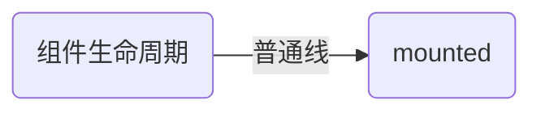
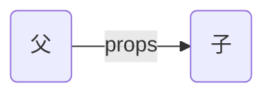
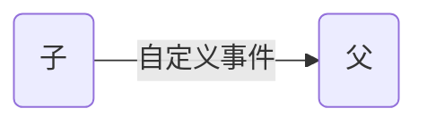

生命周期函数：vue帮我们调用

3.21面试前：

如何实现刷新页面但是页面的倒计时还在？

<font color='cornflowerblue'>完成中</font>

[vue组件的递归自调用~代码思路分析 - 掘金 (juejin.cn)](https://juejin.cn/post/7014130015902105636)


<font color='orange'>以后看</font>

[组件传值（vue2） - 掘金 (juejin.cn)](https://juejin.cn/post/7062174380750536734)

[v-model 和 .sync 的异同点 - 掘金 (juejin.cn)](https://juejin.cn/post/7070408699424014366)

[退出再登录，刚好返回上一次浏览的页面？ - 掘金 (juejin.cn)](https://juejin.cn/post/7072374195421708324)

[聊聊 Vuex - 掘金 (juejin.cn)](https://juejin.cn/post/7072737800105394213)

[你要 偷偷 学 TS，然后惊艳自己！ - 掘金 (juejin.cn)](https://juejin.cn/post/7080541303498342407)

<font color='yellow'>次要</font>

[typora里面如何快捷改变字体颜色？ - 知乎 (zhihu.com)](https://www.zhihu.com/question/385854845/answer/2436199025)

[ECharts 提示框（tooltip）_echarts tooltip_Web Erek的博客-CSDN博客](https://blog.csdn.net/weixin_45536484/article/details/120041612)

[全选、小选和反选的实现 - 掘金 (juejin.cn)](https://juejin.cn/post/7073672975236464670) 	了解

# ES6复习

[ES 6 (yuque.com)](https://www.yuque.com/cessstudy/kak11d/cbd3so#793d034d)


dom--HTMLElenment

```vue
mounted
vue完成模板的解析并把初始真实dom放入页面
```

```
beforeCreated
```

组件挂载？父子组件传参？Vuex数据获取？组件生命周期？还有就是组件内部的getters

**created -> computed -> mounted -> watch -> computed**


## 而 watch 与 computed 的区别

最关键的是watch需要监听值的变化而改变，但是computed从一开始就可以达到和某个值关联起来。

具体讲解：[(48条消息) vue中 computed 与 watch 、 created 与 mounted 彼此的关联与顺序_vue mounted watch_黑子Kuroko的博客-CSDN博客](https://blog.csdn.net/fifteen718/article/details/102937499#:~:text=由此可见，本轮的执行顺序是这样的： created -> computed -> mounted -> watch,-> computed 而 watch 与 computed 的区别，最关键的是 watch需要监听值的变化而改变，但是computed从一开始就可以达到和某个值关联起来。)

[Vue都使用那么久了，还不了解它的生命周期吗✨ - 掘金 (juejin.cn)](https://juejin.cn/post/7032881219524100132)

生命周期：

##  父亲给的数据在mounted之前是否已经拥有？

流程：页面元素-->虚拟dom(位于内存中)-->真实dom

### 正常生命周期钩子的实行顺序

- beforeCreate
- create
- beforeMount
- mounted
- beforeUpdate
- updated
- activated
- deactivated
- beforeDestory
- destoryed

### 父子组件生命周期钩子函数执行顺序表

https://zhuanlan.zhihu.com/p/389292000

**加载渲染过程**

```vue
父beforeCreate->父created->父beforeMount->子beforeCreate->子created->子beforeMount->			子mounted->父mounted
```

**销毁过程**

```
父beforeDestroy->子beforeDestroy->		子destroyed->父destroyed
```

**子组件更新过程**

```
父-beforeUpdate → 子-beforeUpdate→		 父-updated → 子-updated
```

**父组件更新过程**

```
父-beforeUpdate → 父-updated
```

<font color='orange'>实例化数据的核心</font>

```
beforeCreated->inject-> props->methods->data->computed->watch->provide->created
```


## 放大镜效果

事件循环看这懂一个就全会了

```html
  <script>
    console.log('宏任务script1同步任务开始'); //1
    setTimeout(() => {
      console.log('宏任务script1中的定时器宏任务执行'); //9
    }, 0);
    console.log('宏任务script1同步任务结束'); //2
  </script>
  <script>
    console.log('宏任务script2同步任务开始'); //3
    Promise.resolve('6').then(()=>{
      setTimeout(()=>{
        console.log('宏任务script2中的定时器宏任务执行'); //10
      },0)
      console.log('宏任务script2中的微任务执行'); //5
      const myPromise = new Promise(resolve=>{
        console.log('宏任务script2中的微任务中的同步任务开始'); //6
        resolve(console.log('7')) //7
      })
      myPromise.then(()=>{
        console.log('宏任务script2中的微任务中微任务执行'); //8
      })
    }) //
    console.log('宏任务script2同步任务结束'); //4
  </script>
```

答案：

# Vue面试部分

## Vue2和Vue3区别

- 生命周期
- 多根节点
- 组合式API - 选项式API
- 异步组件
- 响应式原理

## 数据劫持？观察者模式？http与https区别？消息订阅与发布？前端跨域问题？jsonp？Vnode？


## 事件冒泡与事件捕获

绑定的事件**默认**的执行时间是在冒泡阶段执行，而非在捕获阶段（重要），这也是为什么当父类和子类都绑定了某个事件，会先调用子类绑定的事件，后调用父类的事件。

### 同时有捕获和冒泡阶段时

先捕获 后冒泡： 先由外向内事件捕获，一直到事发元素，再由内向外冒泡到根节点上

### vue中的事件冒泡与事件捕获

## 数据代理

控制台打印vm时，其data中的属性不难发现是由Object.defineProperty实现的

vue中的数据代理其实就是将data中的数据拷贝 vm._data 中的数据 通过getter 和setter 复制到vm身上，减少代码冗余


 在这里，`vm `拿到`data`中的数据后，放在了`vm`里的`_data`中。实际上`data`就是`_data`。`vm`中的`age`代理了`_data`中的`age`。读取`vm.age`时，调用`get`方法，读取了`_data`中的`age`。修改了`vm`中的`age`时，就会调用`set`方法去修改`_data`中的`age`。估计会有人想为什么要多此一举呢？其实，如果不做代理，那么在“{{  }}”中就要这样写了“{{_data.xxx}}”，会很麻烦。如果想要验证`_data`是否等于`data`。可以这样验证。

## Vue中：key的作用


## Vue中列表过滤的实现：

通过对象/数组的filter方法（根据返回值的真假决定最终有没有对应元素）


## 列表的排序

sort方法：

```javascript
    let persons = [{ id: 'o01', name: '马冬梅', age: 30, sex: '女' },
    { id: 'o02', name: '周冬雨', age: 31, sex: '女' },
    { id: 'o03', name: '周杰伦', age: 18, sex: '男' },
    { id: 'oe4', name: '温兆伦', age: 19, sex: '男' }]
    
    let mypersons = persons.sort((a, b) => b.age - a.age)
    
    for (let j of mypersons) {
      console.log(j.age);
    }//结果按照年龄降序
```

1. 两个参数，a表示第一个元素，b表示第二个元素，会便利length()-1次
2. 返回值：若返回值大于0，a,b互换位置（类似于冒泡排序降序）；反之，位置不变

其他方法[JavaScript数组（Array）方法大全 - 简书 (jianshu.com)](https://www.jianshu.com/p/7e160067a06c)

## 计算属性和侦听属性


## Vue检测数据改变的原理

新增响应式数据通过Vue.set（vue._data.student,"sex","man"）-------!!!				Vue3废除这个设定,Vue3哪怕新增的属性也具有响应式

其它方法如：this.$set 让新添加的数据是响应式的

有些数据默认是没有实现响应式的如：

|                    没有实现响应式                    |           解决方法           |
| :--------------------------------------------------: | :--------------------------: |
| 数组的每个元素----对比数组中对象的属性（可以监听到） | 通过数组原生的方法push...7个 |
|                 对象创建后追加的属性                 |         this.$set()          |

## 自定义指令

调用时机

- 初次绑定成功
- 模板被重新编译

## data为什么一定要写成函数形式**

避免组件被复用时，数据存在引用关系

## localStorage与SessionStorage、cookie区别


localStorage与SessionStorage可以存储5k，cookie只能存储4k

- 相同浏览器下，并且是同源窗口（协议、域名、端口一致），不同页面可以共享localStorage，Cookies值，通过跳转的页面可以共享sessionStorage值。

- 关于sessionStorage，通常说sessionStorage关闭页面即消失，但是通过跳转的页面可以共享sessionStorage值，跳转有多种方式：


```javascript
(1)  <a href="同源页面" target="_self">跳转</a>    //原窗口

(2) <a href="同源页面" target="_blank">跳转</a>  //新开窗口

(3) window.location.href = '同源页面'      //原窗口

(4) window.location.replace('同源页面')   //原窗口

(5) window.open('同源页面')       //新开窗口

(6) this.$router.push({path: '同源页面'})   //通过路由跳转共享值
```
- 不同浏览器无法共享[localStorage](https://so.csdn.net/so/search?q=localStorage&spm=1001.2101.3001.7020)和sessionStorage的值。


## Vuex-为什么action是异步而mutation是同步？

[为什么vuex的Mutations是同步，而Actions是异步 - 掘金 (juejin.cn)](https://juejin.cn/post/7175407205742149669)博主说法

这个actions主要处理mounted，向服务器发异步请求，然后获取数据，修改，保存到state仓库中，然后通过mapState组件能拿到，然后进行遍历数组动态展示数据，这就是前台项目的大部分功能

假设在`mutations`有多个异步的调用，你很难确定这些异步哪些先执行，很难追踪`state`的变化，所以也给调试带来了一定难度

为啥所有的异步操作放在`actions`里面了，`mutation`只负责修改`state`,所有异步操作产生的副作用的结果都统统交给了`mutation`//应该是action

总结

```javascript
灵魂拷问，为什么会有`actions`中是异步，而`mutations`是同步,从官方解释来看，修改state数据必须只能`mutations`中修改，而假设`mutions`内部有异步，那么会带来`devtool`无法准确追踪`state`变化，因为多个异步并不知道哪个异步会先执行完。但是话说回来，`mutations`中有异步，依然可以修改state啊，因为业务中我并不太需要知道`devtool`是如何追踪`state`的变化，但是为了遵从规范，所有的异步都在`actions`中处理，`mutations`只集中干一件事，直接修改`state`值//调试方便

`actions`是`异步`操作的，`actions`中可以有多个异步操作，但是最终的结果依然是交给`mutations`去修改的，也就是说`actions`中异步操作的副作用统一交给了`mutations`去记录

多个异步任务可以在`actions`中触发，`dispatch('xxx')`返回的是一个`Promise`
```

作者回答

博主回答

```javascript
“但我不明白的是，我如果同时出发了两个异步的actions，那么这两个回调的时间不一样，那么对于state的更新还是存在竞态的。所以我觉得这样进行区分并不能解决“那么先回调，哪个后回调”来更新state的问题”你的想法很对，确实不能。异步放在 action 还是放在 mutation ，无非是脏活谁来干的区别。实际上 vuex 是学 redux 的， redux 说把异步放在 action creator 里（对应 vuex 的 action），使得 reducer 是纯函数 （对应 vuex 的 mutation），这样最起码 reducer/mutation 是可以保证正确性的。而 redux 社区正在实践的 redux-thunk/redux-promise，它们解决的是如何更好地写 async action creator 这个问题，而非并发异步竞态的问题。那么我们知道了， async action creator 并不会奇迹般地解决竞态的问题，特别是涉及到服务器数据的情况。可能会有并发提交、可能提交还有可能失败、可能不同的 request 会修改同一个数据，怎么去保证数据的完整性、一致性？我目前觉得在这个问题上比较靠谱的方案是 fb 提出的 immutable app architecture ，用户端有自己的 optimistic record ， 提交时不影响用户操作，提交完成之后用户端状态就会变成 truth record ，从理念上来说非常棒。
```

# ES6

## prototype 和 __proto__ 的区别

任何一个构造函数都有prototype 对象，其作用是为了让不同的实例共享方法。公共属性放到构造函数身上

实例对象身上都有__proto__其指向构造函数的prototype 对象


//true 

查找规则：先查找自身实例对象身上是否有a方法，如果没有，再查找原型对象的a方法


不仅如此：Star.prototype本身也有__prote__对象（Star.prototype又名Star的原型对象）

## 原型链


总结：所有的对象实例和原型对象身上都有—propto—属性，这个属性有一个构造器只想该对象的构造方法

- 如果这个—proto—属性不为NULL，那么用户可以通过.__proto__.__proto__继续访问向上访问直到为空

一般情况下只能访问3层，如图所示

1. 数组a的—proto—指向的是Array的原型对象
2. 数组a的—proto—的—proto—指向的是Object的原型对象
3. 数组a的—proto—的—proto—的—proto—指向的是NULL（因为此时已经到了最顶层的原型对象）

构造方法可以通过prototye属性访问到其原型对象

## var与let、const区别

var

- 可以重复声明与赋值
- 具有变量提升
- 只有全局作用域和函数作用域

let,const

- 增加了块级作用域
- let可以修改但不可以重复声明，const声明之后不可修改,(这个修改指的是内存地址或者是引用的修改)
- 会出现暂时性死区
- 没有变量提升

# 面试题

## 手写instanceOf

```js
    let myInstanceOf = function(arg1,arg2){
        while(arg1.__proto__!=null){
            if (arg1.__proto__ == arg2.__proto__){
                return true;
            }
            arg1 = arg1.__proto__;
        }
        return false;
    }
    let a = []
    let b = new Object();
    console.log(myInstanceOf(a,b));
```

注意，js中的instanceOf只能判断引用类型，不能判断基本数据类型

## HTTP与HTTPS区别

HTTP协议也就是超文本传输协议，是一种使用明文数据传输的网络协议。

HTTPS在HTTP的基础上增加了数据加密 = SSL/TLS + HTTP

- 1.安全性不同
- 2.网站申请流程不同 https协议需要到CA申请证书
- 3.默认端口不同：http使用的是80端口，https使用的是443端口
- 4.对搜索排名的提升

总结：

http：超文本传输协议，明文传输，信息不安全。用的是80端口
https：安全套接字超文本传输协议，有ssl/tsl证书，信息安全。用的443端口

## 为什么要3次握手，4次挥手？

三次握手的最主要目的是保证连接是双工的，可靠更多的是通过重传机制来保证的

## $nexttick

官方定义：在下次 DOM 更新循环结束之后执行延迟回调。在修改数据之后立即使用这个方法，获取更新后的 DOM。

出现原因：Vue不会在数据变化之后立即更新DOM，而是会先收集我们的数据变化，尽可能一次更新DOM。假如有一种场景是这样的【我们数据修改之后想要立即操作DOM】

**理解：****nextTick()，是将回调函数延迟在下一次dom更新数据后调用**，简单的理解是：**当数据更新了，在dom中渲染后，自动执行该函数，**

出现的原因是：因为vue需要捕捉所有的修改记录并在下一次更新的时候一起修改，所有虽然更改了属性，但是还没来得及更新

常常用于更新了数据（由于vue更新dom是异步的，此时dom并没有挂载(更新)成功【当然哪怕display：none的dom元素也无法获取】），但是我们想要立即操作dom或者拿到dom属性

## 浏览器的缓存机制

## v-if 页面抖动问题解决

- 频繁切换的话还是建议v-show

v-if 有更高的切换开销，而 v-show 有更高的初始渲染开销

- 给根元素添加v-clack指令，然后添加样式

官方对于v-clack解释

- 这个指令保持在元素上直到关联实例结束编译

和 CSS 规则如 [v-cloak] { display: none } 一起用时，这个指令可以隐藏未编译的 Mustache 标签直到实例准备完毕。

```vue
<style>
/* 在引入的css文件中写入这个*/
    [v-cloak]{
        display: none;
    }
</style>
<body>
    <!-- 添加这个v-cloak -->
    <div id='app' v-cloak>
        <div v-if="isShow">
        content
        </div>
    </div>
</body>
<script>
    new Vue({
        el: '#app',
        data () {
            return {
                isShow: false
            }
        }
    })
</script>
```

## v-if和v-show区别

在切换 v-if 块时，Vue.js 有一个局部编译/卸载过程，因为 v-if 之中的模板也可能包括数据绑定或子组件。v-if 是真实的条件渲染，因为它会确保条件块在切换当中合适地销毁与重建条件块内的事件监听器和子组件。

v-if 也是惰性的：如果在初始渲染时条件为假，则什么也不做——在条件第一次变为真时才开始局部编译（编译会被缓存起来）。

相比之下，v-show 简单得多——元素始终被编译并保留，只是简单地基于 CSS 切换。


## this指向


答案：


## typeof和instanceof区别

## ===与==区别

## Vue数据双向绑定原理

## vue响应式原理

## ajax请求发送时过程

创建 XMLHttpRequest 对象 ---》  
根据发起请求后状态变化  onreadystatechange()，编写好各个状态要执行的JS ---》  
发起请求：open() 设置请求参数、send() 发送请求  ----》
获得响应结果 responseText/ responseXML ---》

当 readyState 等于 4 且状态为 200 时，表示响应已就绪：

```js
xmlhttp.onreadystatechange=function()
{
    if (xmlhttp.readyState==4 && xmlhttp.status==200)
    {
        document.getElementById("myDiv").innerHTML=xmlhttp.responseText;
    }
}
```

## GET 还是 POST？区别

与 POST 相比，GET 更简单也更快，并且在大部分情况下都能用。

然而，在以下情况中，请使用 POST 请求：

- 无法使用缓存文件（更新服务器上的文件或数据库）
- 向服务器发送大量数据（POST 没有数据量限制）
- 发送包含未知字符的用户输入时，POST 比 GET 更稳定也更可靠

从`w3schools`得到的标准答案的区别如下：

- GET在浏览器回退时是无害的，而POST会再次提交请求。
- GET产生的URL地址可以被Bookmark，而POST不可以。
- GET请求会被浏览器主动cache，而POST不会，除非手动设置。
- GET请求只能进行url编码，而POST支持多种编码方式。
- GET请求参数会被完整保留在浏览器历史记录里，而POST中的参数不会被保留。
- GET请求在URL中传送的参数是有长度限制的，而POST没有。
- 对参数的数据类型，GET只接受ASCII字符，而POST没有限制。
- GET比POST更不安全，因为参数直接暴露在URL上，所以不能用来传递敏感信息。
- GET参数通过URL传递，POST放在Request body中【最直观】


## query参数和params参数

1. params是路由的一部分,必须要在路由后面添加参数名。query是拼接在url后面的参数，没有也没关系。
2. params一旦设置在路由，params就是路由的一部分，如果这个路由有params传参，但是在跳转的时候没有传这个参数，会导致跳转失败或者页面会没有内容。

## HTTP请求的状态码

|      | 类别                             | 原因短语                   |
| :--- | :------------------------------- | -------------------------- |
| 1XX  | Informational（信息性状态码）    | 接收的请求正在处理         |
| 2XX  | Success（成功状态码）            | 请求正常处理完毕           |
| 3XX  | Redirection（重定向）            | 需要进行附加操作以完成请求 |
| 4XX  | Client Error（客户端错误状态码） | 服务器无法处理请求         |
| 5XX  | Server Error（服务器错误状态码） | 服务器处理请求出错         |

- 204：请求成功但是没有资源返回【不允许返回】
- 206：只要某一部分的请求


- 304：允许访问但是访问条件不符合
- 301： 请求的资源已被分配了新的URI
  永久重定向。该状态码表示请求的资源已被分配了新的URI，以后应使用资源现在所指的URI。也就是说，如果已经把资源对应的URI保存为书签了，这是应该按Location首部字段提示的URI重新保存。
- 302：临时重定向
- 303：临时重定向，只允许get请求


- 401:示发送请求需要有通过HTTP认证（BASIC认证、DIGEST认证）的认证信息。另外若之前已进行过1次请求，则表示用户认证失败。
- 403:请求资源的访问被服务器拒绝了
- 404:服务器上无法找到请求的资源


- 500:服务器端在执行请求时发生了错误
- 503:服务器暂时处于超负荷或正在进行停机维护，现在无法处理请求


## Vue父子组件通信

通用

- vuex
- 全局事件总线（$bus）

父传给子代

- props
- provide(Vue3) ----inject

子传递给父亲

- $ref(父亲通过ref绑定子元素拿到数据)
- 自定义事件($emit)

## import和require的区别

###  require/exports 是运行时动态加载，import/export 是静态编译

> CommonJS 加载的是一个对象（即 module.exports 属性），该对象只有在脚本运行完才会生成。而 ES6 模块不是对象，它的对外接口只是一种静态定义，在代码静态解析阶段就会生成。- 阮一峰

### 4. [require/exports 输出的是一个值的拷贝，import/export 模块输出的是值的引用](https://link.zhihu.com/?target=https%3A//es6.ruanyifeng.com/%23docs/module-loader%23ES6-%E6%A8%A1%E5%9D%97%E4%B8%8E-CommonJS-%E6%A8%A1%E5%9D%97%E7%9A%84%E5%B7%AE%E5%BC%82)

require/exports 输出的是值的拷贝。也就是说，一旦输出一个值，模块内部的变化就影响不到这个值。

> require/exports 针对基础数据类型是值的拷贝，导出复杂数据类型时浅拷贝该对象

import/export 模块输出的是值的引用。JS 引擎对脚本静态分析的时候，遇到模块加载命令import，就会生成一个只读引用。等到脚本真正执行时，再根据这个只读引用，到被加载的那个模块里面去取值。

若文件引用的模块值改变，require 引入的模块值不会改变，而 import 引入的模块值会改变。

- import 是解构过程并且是编译时执行
- require 是赋值过程并且是运行时才执行，也就是异步加载
- require的性能相对于import稍低，因为require是在运行时才引入模块并且还赋值给某个变量

# 性能优化

## 常见指令


## 变量释放优化性能

当我们不需要时，将对象的引用释放掉：a = null 那么会被自动垃圾回收机制

# 编码问题/复习

## 自定义指令？自定义事件？

自定义事件用于：子组件向父组件传递数据

### 自定义事件


## 暴露方式

### 默认暴露

```javascript
//模块A中
const a = 12
export default a
 
 
//模块B中
 
import a from './A'  //这边的 a 可以重命名，不影响使用，所以可以这么写
import every from './A'
```


### 按需暴露

```javascript
//模块A中
 
export const a = 12
 
 
//模块B中
 
import {a} from './A'  //这时的 a 是 解构出的具体变量，因此不可以直接起别名，通过下面这种方式重命名
import {a as another}from './A'  //这个时候在模块B中可以用another来使用A中定义的模块和方法
```


## Mixin和Vuex的区别？


Mixin相当于把所有的数据、方法拷贝一份给我们局部混入的对象

### 全局Mixin缺点

因为它会影响每个单独创建的 Vue 实例 (包括第三方组件)。大多数情况下，只应当应用于自定义选项，就像上面示例一样。推荐将其作为[插件](https://link.juejin.cn/?target=https%3A%2F%2Flink.zhihu.com%2F%3Ftarget%3Dhttps%3A%2F%2Fcn.vuejs.org%2Fv2%2Fguide%2Fplugins.html)发布，以避免重复应用混入。

## 组件传参

### props传参



### 自定义事件传参



子代做的是@click = 事件名（）{}

```
子代做的是@click = 事件名(){
	this.$emit('事件名',param1,param2)
}
```

父组件做的是注册自定义事件


- 方式二

```
就是通过自定义事件的参数将子组件的数据发送给父组件
```

### 全局事件总线传参

可以在任意组件间通信

- 注册

- 提供
- 接收

### 消息的订阅与发布

基本不用，可用于任意组件间的通信

### slot插槽

父组件向子组件传递参数

## event事件

1. **clientX**：**相对浏览器窗口**。获取的是相对于当前屏幕的坐标忽略页面滚动因素 
2. **event.offsetX、event.offsetY**：鼠标相对于事件源元素（srcElement）的X,Y坐标offsetX，offsetY 针对目标元素的左上角坐标（e.target）
3. **event.screenX、event.screenY （相对于屏幕）**
4. **layerX,layerY** 往上找有定位属性的父元素的左上角（自身有定位属性的话就是相对于自身），都没有的话，就是相对于body的左上角

## 路由参数query与params

直白的来说query相当于get请求，页面跳转的时候，可以在地址栏看到请求参数，而params相当于post请求，参数不会再地址栏中显示。

## 解构赋值

- 原始写法
- 解构赋值
- 连续解构赋值

## 切换组件依旧展示原有组件的内容//***更多的之后再说

常用方法是：将路由组件缓存

## 路由重定向

[Vue Router重定向指南 - 掘金 (juejin.cn)](https://juejin.cn/post/7108925024492322829)

## 路由守卫


## 代理跨域问题

在尚品汇中的一个项目中配置成功：


疑问的是为何请求的URL里面竟然是localhost：8080？

至于哪里为什么多了一个api应该是：请求拦截器里面写的baseURL

后面的直接写路径就行


# 项目BUG

项目中的那个购物车模块的数据我实在是拿不到，但是视频中的方法却可以拿到，原因未知？

可能是，computed从vuex获取数据（异步操作）？-> mounted -> 数据更新，computed更新数据？


